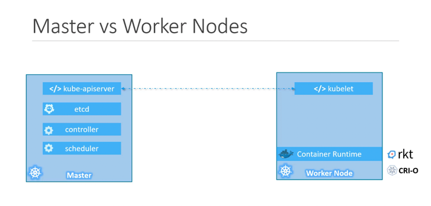

# reviewing-kubernetes-concepts

### Kubernetes Nodes
Nodes are simply, worker machines where kubernetes launch the containers. A group of kubernetes nodes are called cluster.
**Master Node, or simply, Control Plane** watches the nodes and manages the workload of worker nodes.

### Kubernetes components
Installing Kubernetes on a system actually installs the below components on a system.
#### API Server
Acts as the frontend of Kubernetes. Provides the APIs for all kind of UI tools to talk to the kubernetes cluster. It resides usually in the master node.
#### etcd Keystore
Distributed reliable key-value store to keep all the data within kubernetes cluster.
#### Scheduler
Responsible for distributing workloads (containers) among multiple nodes. It looks for newly created containers and assign them to nodes.
#### Controller
The brain behind the orchestration. If any node / container / endpoint goes down, it takes the decision to bring up the new container or the node.
#### Container Runtime
Where containers run. For example, docker, rocket, cri-o, podman etc.
#### Kubectl
An agent that runs on each node of the cluster. It makes sure that the container is running as expected. 
It usually resides in worker nodes and communicate with kube-apiserver in the master node.

### Kubernetes component workflow


### Common Kubernetes Objects

Every kubernetes object manifest file has 4 root level fields:

- **apiVersion:** Version of the **kind** definition
- **kind:** Can be Pod, Deployment, ReplicaSet, ConfigMap, Service, Ingress, Job, etc.
- **metadata:** Contains metadata of a manifest denition, can be used by other objects.
- **spec:** Specification based on which the object will be created
#### Namespace
Namespace can be simply described as a group or a common area. All the resources (kubernetes objects) reside under the same namespace.

**Example namespace definition:**
```todo.namespace.yaml
# todo.namespace.yaml
apiVersion: v1
kind: Namespace
metadata:
  name: todo-ns
  labels:
    app.kubernetes.io/name: todo-ns
    environment: development # Or staging, production, etc.
  annotations:
    description: "Namespace for the ToDo application and its related components."
```
To create the `todo-ns` namespace:
```shell
kubectl apply -f todo.namespace.yaml
```

To see the available namespaces in the system:
```shell
kubectl get ns
```

To set `todo-ns` as default namespace:
```shell
kubectl config set-context $(kubectl config current-context) --namespace=todo-ns
```

To verify the change of the namespace for the current context:
```shell
kubectl config view --minify | grep namespace:
```

#### Pod
Consists of at least 1 container. Sometimes, can have sidecar (helper) containers as well.

**Example manifest definition:**
```mysql-pod.yaml
# mysql-pod.yaml
apiVersion: v1 # Pods are v1 API version
kind: Pod # Specify the kind as Pod
metadata:
  name: todo-db-pod # Give the Pod a unique name
  namespace: todo-ns # Specify the namespace
  labels:
    app: todo-db # Keep the label for consistency, though not strictly required for a standalone Pod
spec:
  containers:
  - name: mysql
    image: mysql:8.0
    env:
    - name: MYSQL_ROOT_PASSWORD
      valueFrom:
        secretKeyRef:
          name: mysql-root-password
          key: MYSQL_ROOT_PASSWORD
    ports:
    - containerPort: 3306
      name: mysql
    volumeMounts:
    - name: mysql-persistent-storage
      mountPath: /var/lib/mysql
    - name: mysql-init-volume
      mountPath: /docker-entrypoint-initdb.d
  volumes:
  - name: mysql-persistent-storage
    persistentVolumeClaim:
      claimName: mysql-pv-claim
  - name: mysql-init-volume
    configMap:
      name: mysql-init-scripts

```
To run the pod:

```shell
kubectl apply -f mysql-pod.yaml
```

To see all the running pods, you can run:
```shell
kubectl get pods
```
To inspect the pod definition:
```shell
kubectl describe pod todo-db-pod
```
#### Deployment
Contains one or more pod definition.

**Example manifest definition**
A deployment can contain the declaration of replicas under spec section and the pod definitions under template section.
The `selector.matchLabels` refers to the `label` of pod definition.

```04-mysql-deployment.yaml
# 04-mysql-deployment.yaml
apiVersion: apps/v1
kind: Deployment
metadata:
  name: todo-db-deployment
  namespace: todo-ns # <--- Namespace specified here
  labels:
    app: todo-db
spec:
  replicas: 1
  selector:
    matchLabels:
      app: todo-db
  strategy:
    type: Recreate
  template:
    metadata:
      labels:
        app: todo-db
    spec:
      containers:
        - name: mysql
          image: mysql:8.0
          env:
            - name: MYSQL_ROOT_PASSWORD
              valueFrom:
                secretKeyRef:
                  name: mysql-root-password
                  key: MYSQL_ROOT_PASSWORD
          ports:
            - containerPort: 3306
              name: mysql
          volumeMounts:
            - name: mysql-persistent-storage
              mountPath: /var/lib/mysql
            - name: mysql-init-volume
              mountPath: /docker-entrypoint-initdb.d
      volumes:
        - name: mysql-persistent-storage
          persistentVolumeClaim:
            claimName: mysql-pv-claim
        - name: mysql-init-volume
          configMap:
            name: mysql-init-scripts
```
#### Services
Services are used to bind network to the pods. Services can be of 4 types.

**ClusterIP:** Only accessible by services running inside the kubernetes cluster. Doesn't expose outside.

Example:
```05-mysql-service.yaml
# 05-mysql-service.yaml
apiVersion: v1
kind: Service
metadata:
  name: todo-db-service # This name will be the DNS name for other services to connect to MySQL
  namespace: todo-app
  labels:
    app: todo-db
spec:
  selector:
    app: todo-db # Selects pods with the label app: todo-db
  ports:
    - protocol: TCP
      port: 3306 # The port the service exposes
      targetPort: 3306 # The port the container listens on
  type: ClusterIP # Internal to the cluster. Recommended for databases.
  # If you *really* need external access (not recommended for DBs), change to:
  # type: NodePort
  # or type: LoadBalancer (if your cluster has a LoadBalancer controller like MetalLB)

```

**NodePort:** Upon the definition of `nodePort` under the `ports` section and mentioning the Service `type: NodePort` the service becomes accessible to the host with the `clusterIp:nodePort`.
Example:
```05-mysql-service.yaml
# 05-mysql-service.yaml
apiVersion: v1
kind: Service
metadata:
  name: todo-db-service
  namespace: todo-ns # <--- Namespace specified here
  labels:
    app: todo-db
spec:
  selector:
    app: todo-db
  ports:
    - protocol: TCP
      port: 3306        # The port on the Service (internal to cluster)
      targetPort: 3306  # The port on the Pod/container
      nodePort: 30306   # <--- This is the crucial line for NodePort
                        #     (Optional: If omitted, Kubernetes assigns a random port from 30000-32767)
  type: NodePort      # <--- Change this from ClusterIP to NodePort
```

Apply the todo db service:

```shell
kubectl apply -f 05-mysql-service.yaml
```

If you are using Minikube cluster, you can get your node ip address as follows:

```shell
minikube ip
```
**LoadBalancer:** If a load balancer is provided, the service is exposed with a domain name to that loadBalancer.
```05-mysql-service.yaml
# 05-mysql-service.yaml
apiVersion: v1
kind: Service
metadata:
  name: todo-db-service
  namespace: todo-ns
  labels:
    app: todo-db
spec:
  selector:
    app: todo-db
  ports:
    - protocol: TCP
      port: 3306        # The port on the Service (internal to cluster)
      targetPort: 3306  # The port on the Pod/container
  type: LoadBalancer
  loadBalancerIP: 192.168.49.201
```
You can enable LoadBalancer support for minikube in 2 ways. 


i. Native support, enable minikube node balancer:
```shell
minikube tunnel
```
ii. With metallb plugin:
Enable metallb plugin for minikube:
```shell
minikube addons enable metallb
```
Startup metallb service:
```shell
kubectl apply -f https://raw.githubusercontent.com/metallb/metallb/v0.14.5/config/manifests/metallb-native.yaml
```

Configure load balancer IP range for services:
```metallb.config.yaml
# metallb.config.yaml
apiVersion: metallb.io/v1beta1
kind: IPAddressPool
metadata:
  name: my-ip-pool
  namespace: metallb-system
spec:
  addresses:
  - 192.168.49.200-192.168.49.250  # Use minikube's network range

```

Apply the metallb config file:
```shell
kubectl apply -f metallb.config.yaml
```

Apply the todo db service:
```shell
kubectl apply -f 05-mysql-service.yaml
```

**ExternalName:** Maps the service to a DNS name, not to any Pods.


#### ConfigMap
ConfigMap refers to key-value paired static data, used mainly for configurations.

```02-mysql-init-configmap.yaml
# 02-02-mysql-init-configmap.yaml
apiVersion: v1
data:
  init.sql: |
    CREATE DATABASE IF NOT EXISTS todo_app_db;
    USE todo_app_db;
    CREATE TABLE IF NOT EXISTS tasks (
        id INT AUTO_INCREMENT PRIMARY KEY,
        description VARCHAR(255) NOT NULL,
        completed BOOLEAN DEFAULT FALSE
    );
    INSERT INTO tasks (description) VALUES ('Learn Kubernetes');
    INSERT INTO tasks (description) VALUES ('Build a ToDo app');
kind: ConfigMap
metadata:
  creationTimestamp: null
  name: mysql-init-scripts
  namespace: todo-ns # <--- Namespace specified here
```
#### Secret

Secrets are also key-value paired static data, but specially used to hold credentials and other secret values. When stored, secret vault encode/encrypt them according to the mentioned mechanism. The default encoding mechanism is base64 string.

```01-mysql-secret.yaml
# 01-mysql-secret.yaml
apiVersion: v1
kind: Secret
metadata:
  name: mysql-root-password
  namespace: todo-ns # <--- Namespace specified here
type: Opaque
stringData:
  MYSQL_ROOT_PASSWORD: "@root#" # <--- CHANGE THIS TO A STRONG PASSWORD!

```
#### PersistentVolumeClaim
PersistentVolumeClaim, in short, pvc creates volume to store application generated data. 

```03-mysql-pvc.yaml
# 03-mysql-pvc.yaml
apiVersion: v1
kind: PersistentVolumeClaim
metadata:
  name: mysql-pv-claim
  namespace: todo-ns # <--- Namespace specified here
spec:
  accessModes:
    - ReadWriteOnce
  resources:
    requests:
      storage: 5Gi
  # storageClassName: standard # Uncomment and specify if you don't have a default StorageClass or want a specific one

```
#### Ingress Controller and Ingress
(Ingress Controller HandsOn)[https://github.com/mainul35/reviewing-kubernetes-concepts/blob/main/kubernetes-ingress-controller-demo/readme.md]

### Kubernetes basic commands

#### Get all resources currently running
```shell
kubectl get all
```
